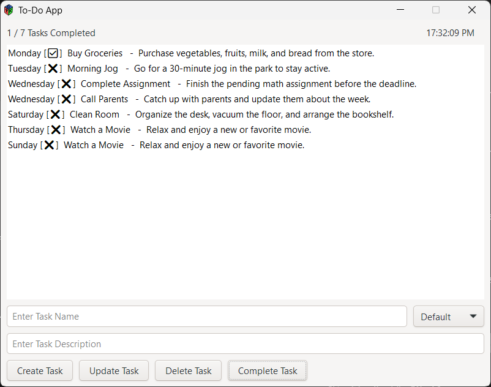
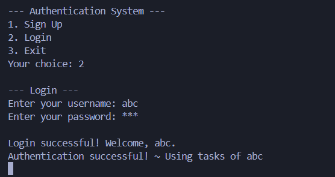

# To-Do Application

## Overview
This is a simple GTK-based To-Do list application. The app allows users to manage tasks efficiently through a graphical interface. The operations include adding, editing, and deleting tasks. A real-time clock is displayed in the interface for convenience. Users can filter tasks by day of the week and save and load tasks from a file. The app also allows users to mark tasks as completed or incomplete.

## Run the project
The project can be compiled first, using the provided bash script:
```bash
./script.bash
```
and run using
```bash
./ToDo_Application.exe
```

## Images



## Features
1. **User Authentication**  
   - Users can sign up and log in to access the app.

2. **Add Tasks**  
   - Users can input a task name and description and add it to the task list.
   - The task list updates dynamically.

3. **Edit Tasks**  
   - Users can select an existing task, modify its name or description, and update it in the list.

4. **Delete Tasks**  
   - Users can remove a selected task from the list.

5. **Real-Time Clock**  
   - A clock is displayed in the app, updating every second to show the current time.

6. **Filter Tasks by Day**  
   - Users can filter the task list by day of the week.

7. **Save and Load Tasks**  
   - Users can save and load tasks from a file.

8. **Task Completion Status**  
   - Users can mark tasks as completed or incomplete.

## Usage Instructions
1. **Adding a Task**  
   - Enter a task name and description in the respective fields.
   - Click the "Add Task" button to save the task to the list.

2. **Editing a Task**  
   - Select a task from the list.
   - Modify the task name and/or description in the input fields.
   - Click the "Edit Task" button to save changes.

3. **Deleting a Task**  
   - Select a task from the list.
   - Click the "Delete Task" button to remove the task from the list.

4. **View Clock**  
   - The clock at the top of the app updates automatically.

5. **Filter Tasks by Day**  
   - Use the dropdown menu to select a day of the week.
   - The task list updates to show only tasks for the selected day.

## Requirements
- GTK 3.x must be installed on your system.
- A builder XML file (`builder.xml`) is required to define the UI layout. (You can download it from the GitHub repository.)
